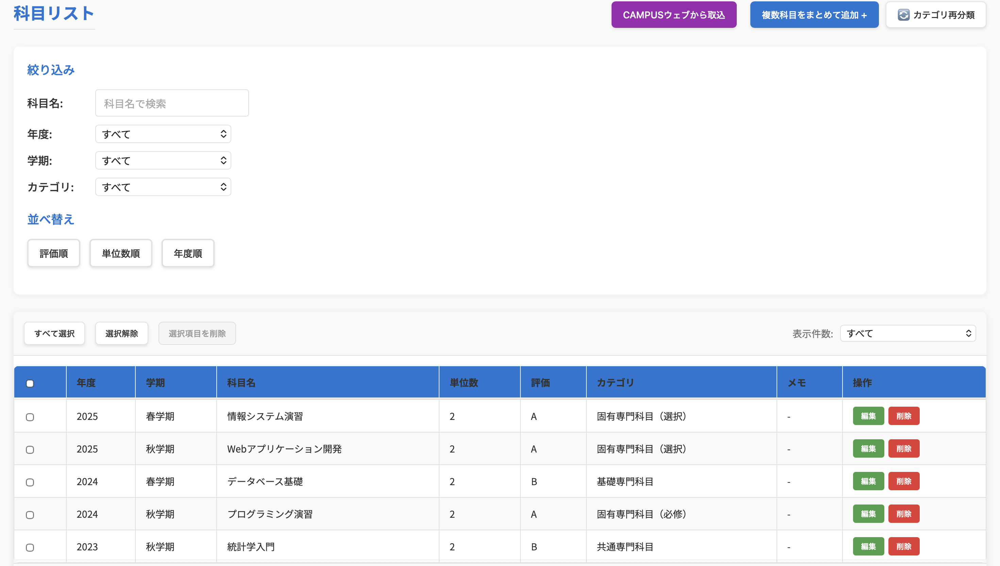
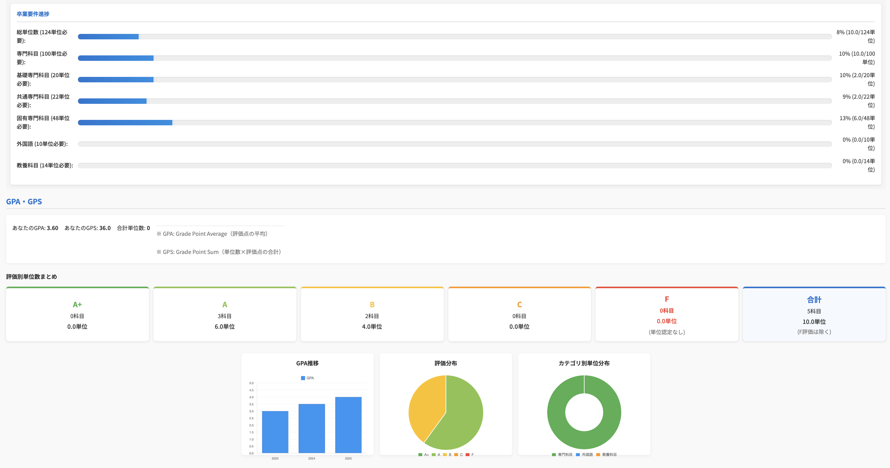

# seiseki-kanri

成績・単位情報を管理し、GPA/GPSや単位取得状況を可視化するためのFlask製Webアプリです。

大学の成績ページから取得したHTMLを手動で貼り付け、科目名・単位数・評価・年度・カテゴリなどを整理できるようにすることを目的に作成しました。

> **注意**  
> このアプリは大学公式のサービスではありません。  
> 個人開発・学習目的で作成した非公式ツールです。  
> 成績情報や個人情報を扱うため、ローカル環境での利用を想定しています。

---

## 概要

このアプリでは、成績情報を手動入力またはHTML貼り付けによって登録し、以下のような情報を確認できます。

- 登録した科目一覧
- GPA / GPS の自動計算
- 取得単位数の集計
- カテゴリ別の単位取得状況
- 年度別のGPA推移
- 評価別の単位分布
- 登録ユーザー間の簡易ランキング表示

成績データはSQLiteに保存されます。

---

## 画面イメージ

> 以下はダミーデータを用いた画面例です。実際の成績情報は含まれていません。

### 科目管理画面



### GPA・単位取得状況の可視化画面



---

## 主な機能

### 成績データ管理

科目ごとに以下の情報を登録・編集・削除できます。

- 年度
- 学期
- 科目名
- 単位数
- 評価
- 科目カテゴリ
- メモ

### HTML貼り付けによる一括インポート

大学ポータル上の成績表HTMLを手動で貼り付けることで、科目情報をまとめて取り込めます。

外部APIと自動連携するものではなく、ユーザーが取得したHTMLをローカル環境で解析する仕組みです。

### GPA / GPS の可視化

登録された評価と単位数をもとに、GPAやGPSを自動計算します。

また、年度別のGPA推移や評価別の単位数をグラフで確認できます。

### 単位取得状況の確認

カテゴリごとに取得単位数を集計し、卒業要件に対する進捗を確認できます。

### ユーザー登録・ログイン

Flask-Loginを用いて、ユーザーごとに成績データを分けて管理できます。

---

## 使用技術

### バックエンド

- Python
- Flask
- SQLite
- Flask-Login
- Flask-WTF
- BeautifulSoup4

### フロントエンド

- HTML
- CSS
- JavaScript
- Chart.js

### その他

- Git / GitHub
- python-dotenv

---

## 工夫した点

### 1. 成績HTMLの解析処理

成績ページのHTMLをBeautifulSoupで解析し、科目名・単位数・評価・年度・学期などを抽出できるようにしました。

単純な手入力だけでなく、HTML貼り付けによる一括登録に対応したことで、入力の手間を減らしています。

### 2. GPA / GPS の自動計算

登録された評価と単位数をもとに、GPAとGPSを自動計算するようにしました。

F評価や年度不明の科目の扱いも考慮し、単位取得数とGPA計算で扱いを分けています。

### 3. 単位取得状況の可視化

カテゴリ別の単位数や評価分布をグラフで表示し、現在の単位取得状況を直感的に確認できるようにしました。

### 4. ユーザーごとのデータ分離

Flask-Loginを用いてログイン機能を実装し、各ユーザーが自分の成績データのみを管理できるようにしました。

### 5. 公開リポジトリを意識した設定

`.env`やSQLiteデータベースをGit管理に含めないようにし、環境変数のサンプルとして`.env.example`を用意しています。

---

## セットアップ

### 1. リポジトリをクローン

```bash
git clone https://github.com/GoNakano/seiseki-kanri.git
cd seiseki-kanri
```

### 2. 仮想環境を作成

```bash
python3 -m venv .venv
source .venv/bin/activate
```

Windowsの場合:

```bash
.venv\Scripts\activate
```

### 3. 依存関係をインストール

```bash
pip install -r requirements.txt
```

### 4. 環境変数ファイルを作成

```bash
cp .env.example .env
```

`.env`内の`SECRET_KEY`や`ADMIN_PASSWORD`は必要に応じて変更してください。

### 5. アプリを起動

```bash
python3 app.py
```

開発環境では、以下のURLからアクセスできます。

```text
http://localhost:5000
```

ポートが使用中の場合は、`.env`の`PORT`を変更してください。

```env
PORT=5001
```

---

## 開発用初期アカウント

開発環境では、初回起動時に管理者ユーザーが作成されます。

```text
ユーザーID: admin
パスワード: .env の ADMIN_PASSWORD に設定した値
```

`.env.example`をそのままコピーした場合は、サンプル用のパスワードが使用されます。  
公開環境で利用する場合は、必ず`.env`で強力なパスワードを設定してください。

---

## 使い方

### 手動で科目を追加する

1. ログインする
2. 科目追加フォームに科目名・単位数・評価などを入力する
3. 追加ボタンを押す
4. 科目一覧やGPA/GPSに反映される

### HTMLから一括インポートする

1. 大学ポータルの成績ページを開く
2. 成績表部分のHTMLを取得する
3. アプリのHTMLインポート機能に貼り付ける
4. 解析結果を確認する
5. 問題なければ一括登録する

---

## 注意事項

このアプリは非公式の個人開発アプリです。

- 大学公式のサービスではありません
- 外部サービスと自動連携するものではありません
- 成績情報や個人情報を扱うため、ローカル環境での利用を想定しています
- 実際の成績データや個人情報を含むDBファイルはGitHubに公開しないでください
- 計算結果はあくまで自己管理用の参考値です
- 大学の制度変更や成績表HTMLの変更により、インポート処理が正しく動作しなくなる可能性があります

---

## 公開時に含めないファイル

以下のファイルはGitHubに公開しないようにしています。

```text
.env
*.db
*.sqlite
*.sqlite3
__pycache__/
.DS_Store
```

成績データを含むSQLiteファイルは、必ずローカル環境で管理してください。

---

## 学んだこと

この開発を通して、以下を学びました。

- Flaskを用いたWebアプリケーション開発
- SQLiteを用いたデータ管理
- Flask-Loginによる認証機能の実装
- BeautifulSoupによるHTML解析
- JavaScriptによる動的なUI更新
- Chart.jsを用いたデータ可視化
- `.env`や`.gitignore`を用いた公開リポジトリの管理
- 個人情報を扱うアプリを公開する際の注意点

---

## 今後の改善案

- アプリ構成をファイル分割して保守性を高める
- 科目カテゴリ判定ルールを外部設定ファイルに分離する
- テストコードを追加する
- サンプルデータを用意してデモしやすくする
- エラーハンドリングを整理する
- UIをより見やすく改善する
- Dockerで起動できるようにする

---

## ライセンス

このリポジトリは個人開発・学習目的で公開しています。
